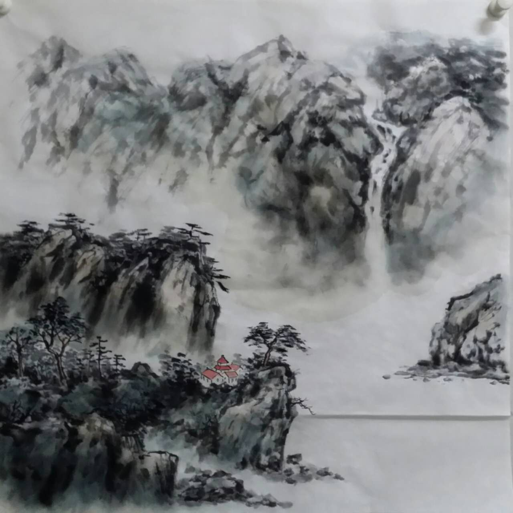
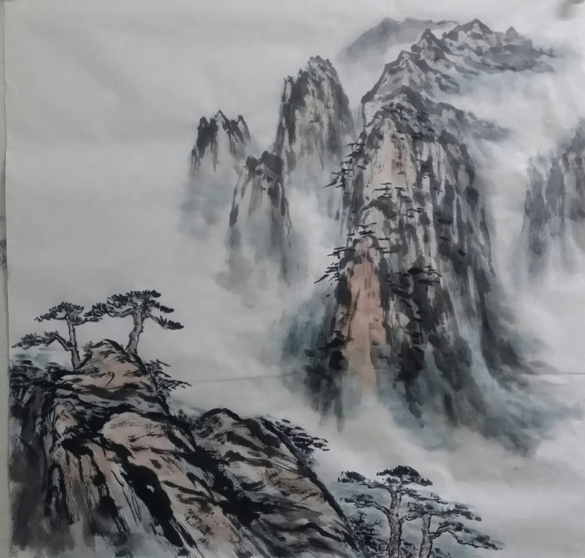
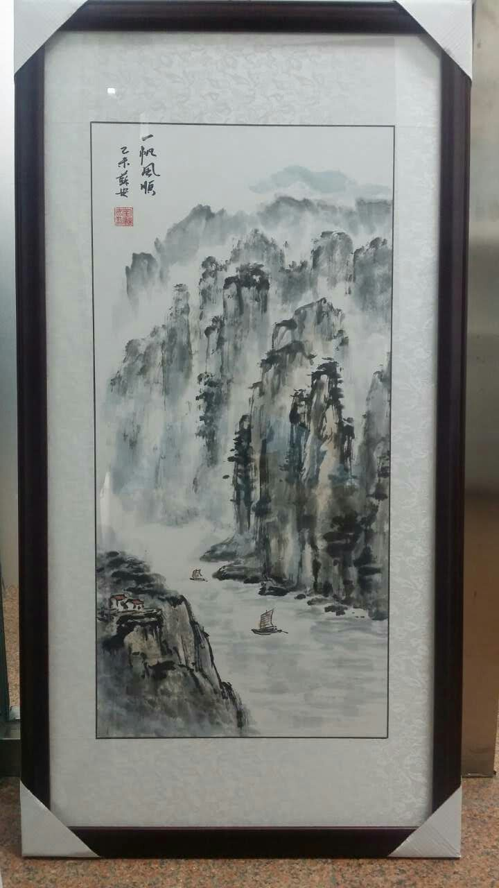
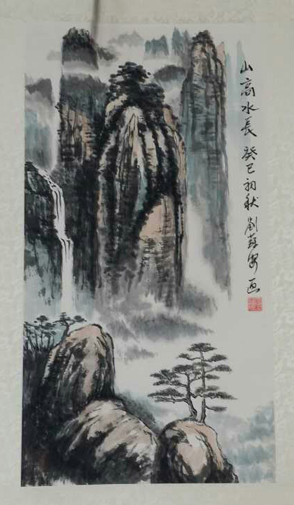
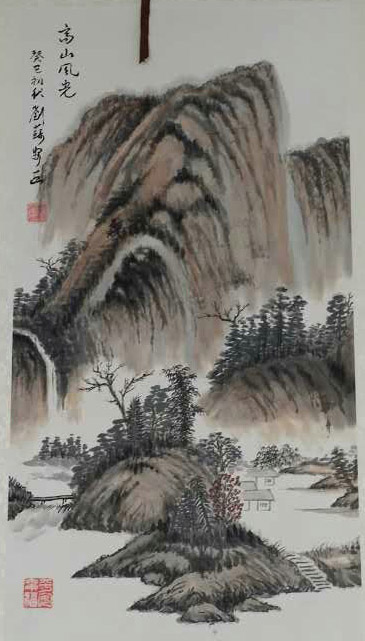
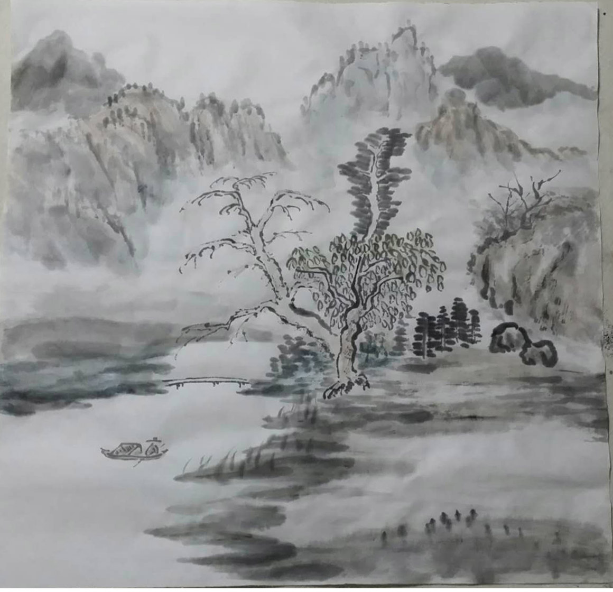
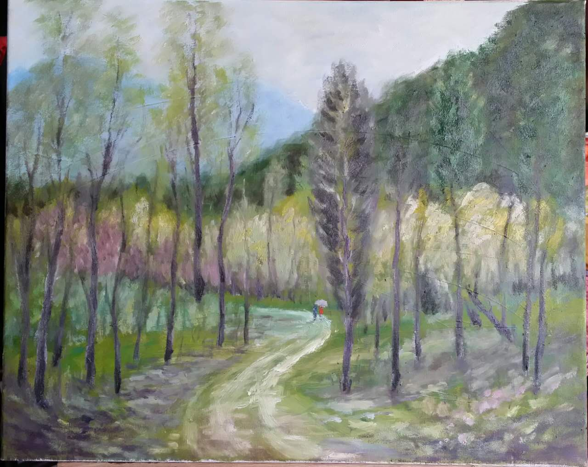

# 墨轩蘇安的博客

## 刘苏安

刘苏安，1960年出生，北京人，毕业于中华社会大学电化教育专业，中共中央党校法律本科。

中国书画函授学院素描专业。现为北京西城书画协会会员。釋竹文化艺术研究院理事。进修油画、国画。最擅长油画风景和国画山水。

参加2014年10月参加人民日报社组办的“美丽中国，风采万里”画展，获得优秀奖；参加澳门回归十五周年画展；西城美协组办的“大美西城画展”“春之花书画展”等；作品被中国电影博物馆收藏。还多次参加书画捐赠活动。

其作品描绘的北京古韵，大气雄浑、清新雅致再现北京风景魅力，赏此永恒之美。

## 作品小样

